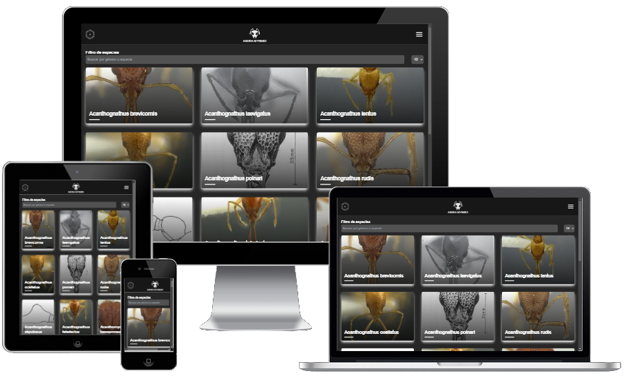

# 🐜 Agora Myrmex 🐜

Agora Myrmex es una plataforma educativa dedicada a la comunidad mirmecológica global. Mi objetivo es proporcionar recursos completos y accesibles para el cuidado responsable de hormigas, ayudando tanto a principiantes como a expertos en su viaje por la mirmecología.


🌐 **[Visitar Sitio Web](https://agora-myrmex.vercel.app/es)** | 🤝 **[Contribuir](mailto:aquintanalm.dev@gmail.com)**

---


## Interfaz de Usuario

*   📱 Diseño totalmente responsive optimizado para móviles, tabletas y escritorio
*   🎨 Interfaz moderna e intuitiva
*   🌍 Soporte multiidioma

## Contenido

*   📚 Guías detalladas de cuidado de hormigas
*   🔍 Sistema de clasificación taxonómica
*   📊 Parámetros específicos de cuidado por especie
*   🗂️ Base de datos completa de especies

## Técnicas

*   ⚡ Optimización de rendimiento y carga rápida
*   🛠️ Arquitectura modular y escalable
*   🔒 Seguridad y protección de datos
*   📊 Integración con Supabase para gestión de datos

## 🛠️ Tecnologías

*   **Frontend**:

    *   Next.js v15.1.4
    *   React v19.0.0
    *   TailwindCSS para estilos


*   **Backend**:

    *   Supabase (PostgreSQL)
    *   API RESTful


*   **Herramientas de Desarrollo**:

    *   Node.js v22.13.1
    *   npm v10.9.2
    *   ESLint para linting
    *   Prettier para formateo de código

## 📋 Requisitos

```bash
node -v # v22.13.1
npm -v  # v10.9.2
```

## 🚀 Instalación

Ya que este proyecto utiliza base de datos propia a la que no quiero que se tenga acceso para evitar posibles problemas, no se administrará una guía de instalación completa ya que las variables de entorno no se compartirán 😟

## ☕ Cómprame un cafetin

<a href="https://www.buymeacoffee.com/aaronquintanal" target="_blank"></a>


--- 

Desarrollado con ❤️ por Aarón Quintanal Martín